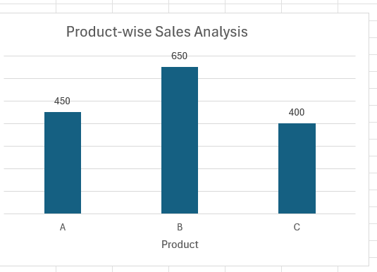
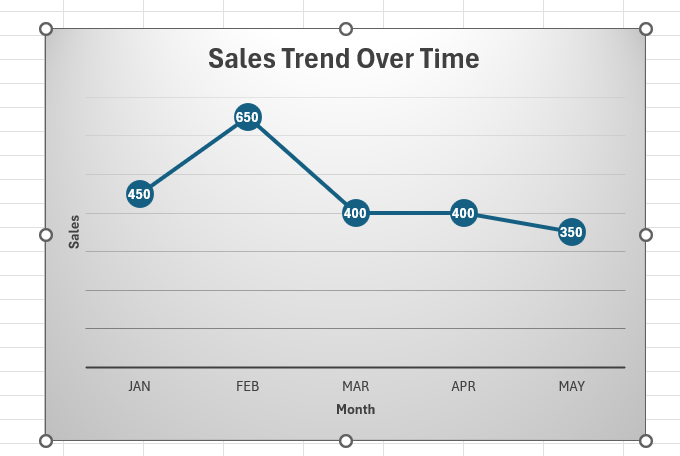
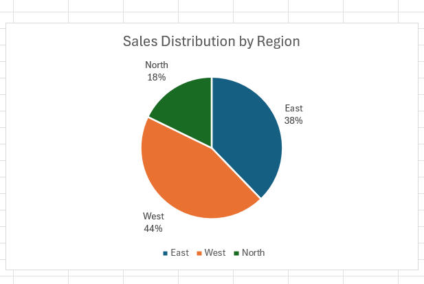
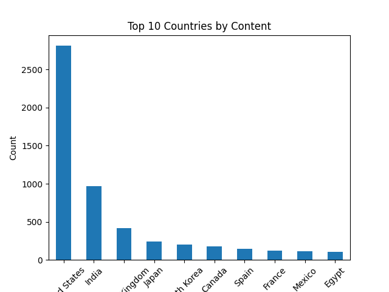

# data-visualization-project
Data visualization project using Excel dashboards
# 📊 Sales Data Analysis using Excel

## 🔧 Tools Used
- Microsoft Excel
- Data Visualization (Charts)

## 📌 Project Description
This project analyzes sales data using Excel and visualizes key insights using charts.

---

## 📊 Visualizations

### 1. Product-wise Sales Analysis

### 2. Sales Trend Over Time

### 3. Sales Distribution by Region

Python Analysis
- Data cleaning using Pandas
- Aggregation using groupby
- Visualization using Matplotlib

Notebook:
sales_analysis.ipynb

---

## 💡 Key Insights
- Product B has the highest sales
- Sales peaked in February
- West region contributes the most sales

- # 📊 Netflix Data Analysis (Python Project)

## 🛠️ Tools Used

* Python (Pandas, Matplotlib)

## 📌 Project Description

Analyzed Netflix dataset to understand content distribution, trends, and production insights.

---

## 📈 Visualizations

Movies vs TV Shows

Top Countries

Content Trend Over Time

---

## 💡 Key Insights

* Netflix has more Movies than TV Shows
* Content increased significantly after 2015
* United States produces the most content

