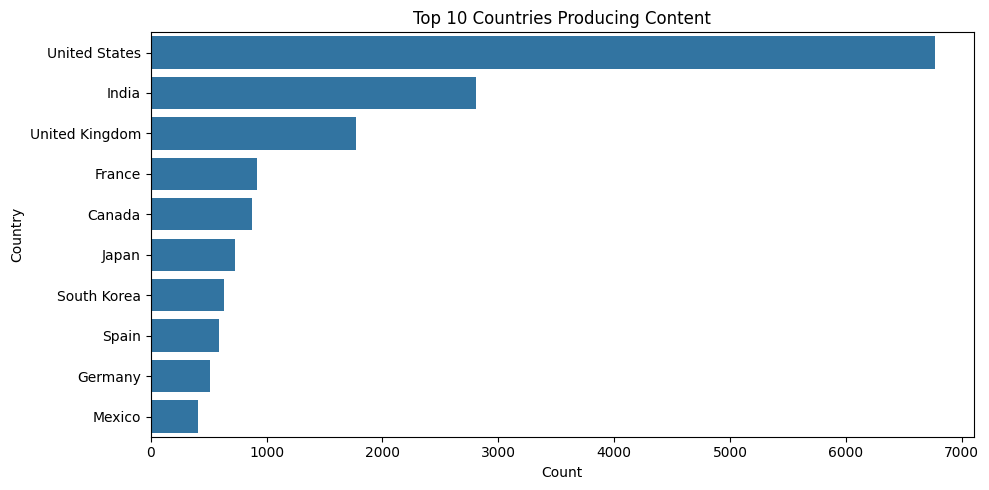
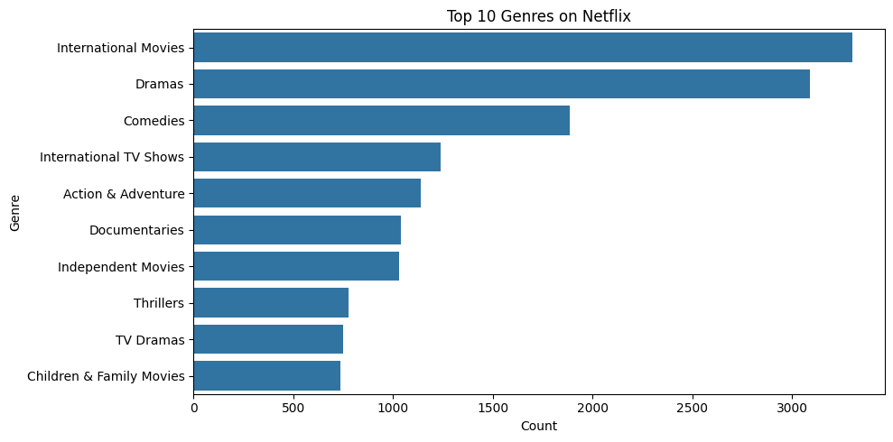
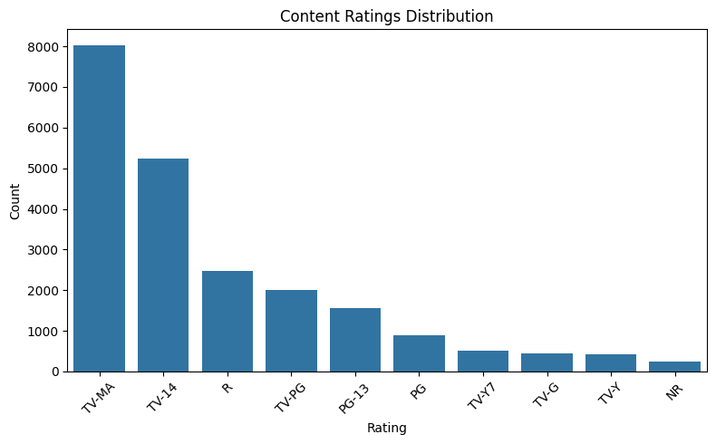

# data-visualization-project
Data visualization project using Excel dashboards
# 📊 Sales Data Analysis using Excel

## 🔧 Tools Used
- Microsoft Excel
- Data Visualization (Charts)

## 📌 Project Description
This project analyzes sales data using Excel and visualizes key insights using charts.

---
# 📊 Netflix Data Analysis Project

## 📌 Overview
This project analyzes Netflix dataset using Python to uncover trends in content distribution, growth, and countries.

---

## 🛠️ Tools & Technologies
- Python
- Pandas
- Matplotlib

---

## 📊 Visualizations

### 1. Movies vs TV Shows

### 2. Top Countries Producing Content

### 3. Content Trend Over Time

---

## 💡 Key Insights
- Movies dominate Netflix content
- USA produces the most content
- Content growth increased after 2015

---

## 📁 Dataset
Netflix dataset (cleaned using Pandas)

---

## 🚀 Future Improvements
- Add Seaborn visualizations
- Build dashboard using Streamlit

- ## 📈 Visualizations

### Movies vs TV Shows

### Top Countries

### Content Trend Over Time

# 📊 Netflix Data Analysis (Advanced)

## 📌 Overview

Advanced analysis of Netflix dataset using Pandas and Seaborn. Includes data cleaning, multi-value column handling, and insight generation.

---

## 🛠️ Tech Stack

* Python
* Pandas
* Matplotlib
* Seaborn

---

## 📈 Visualizations

### Top Countries (Cleaned)

### Top Genres

### Ratings Distribution

### Content Trend

---

## 💡 Key Insights

* Movies dominate Netflix content distribution
* USA is the leading content producer
* Drama/International content is highly prevalent
* Majority of content falls under TV-MA rating
* Significant growth after 2015

---

## 🚀 What I Learned

* Handling messy real-world data
* Using explode() for multi-value columns
* Advanced Pandas operations
* Data storytelling

---

